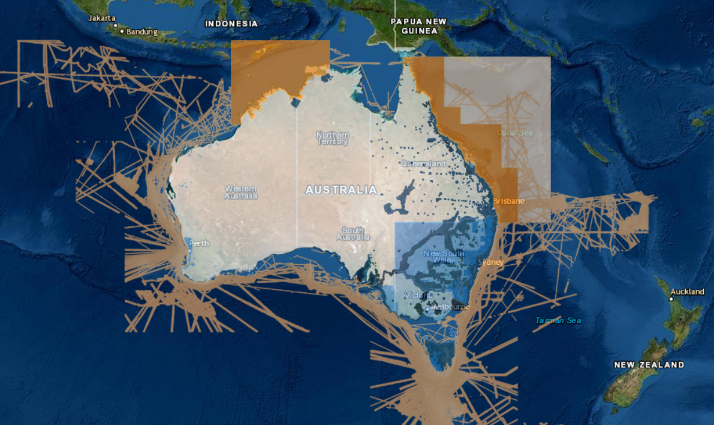
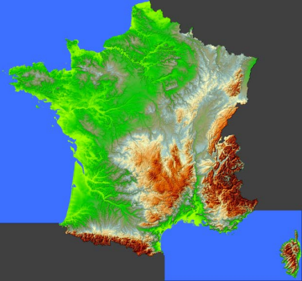
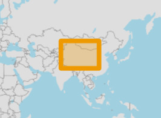
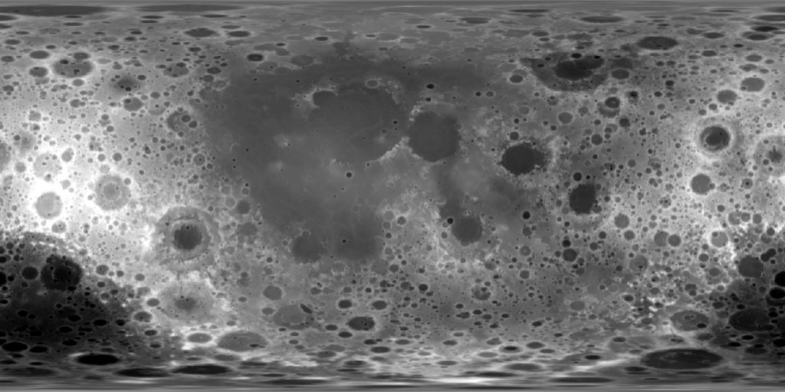
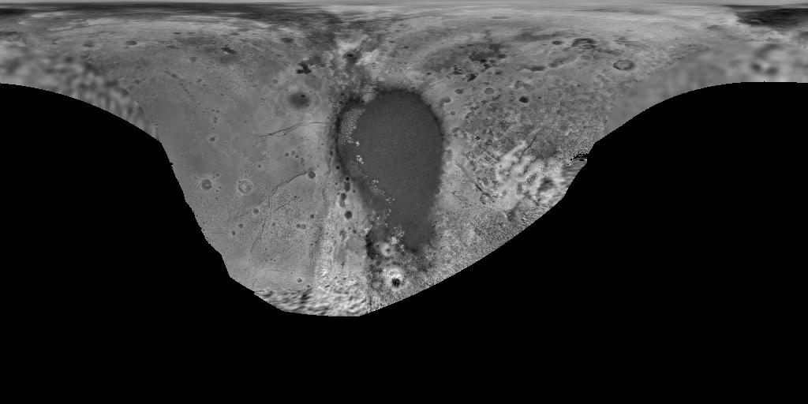
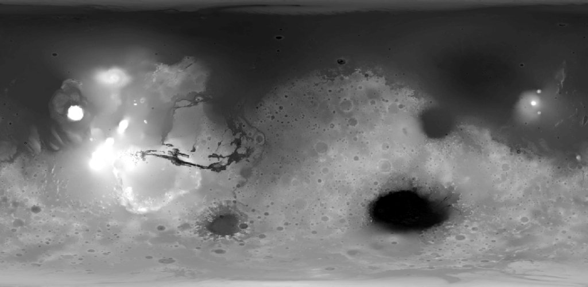
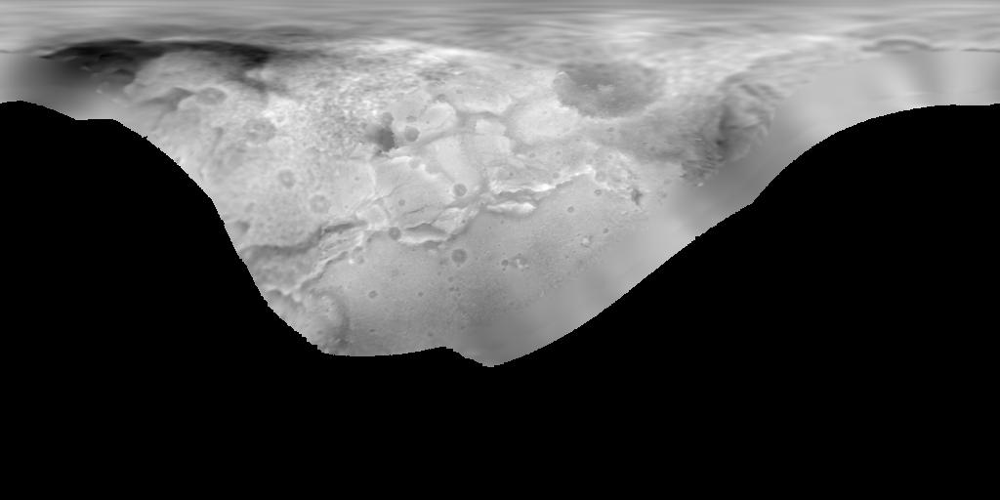
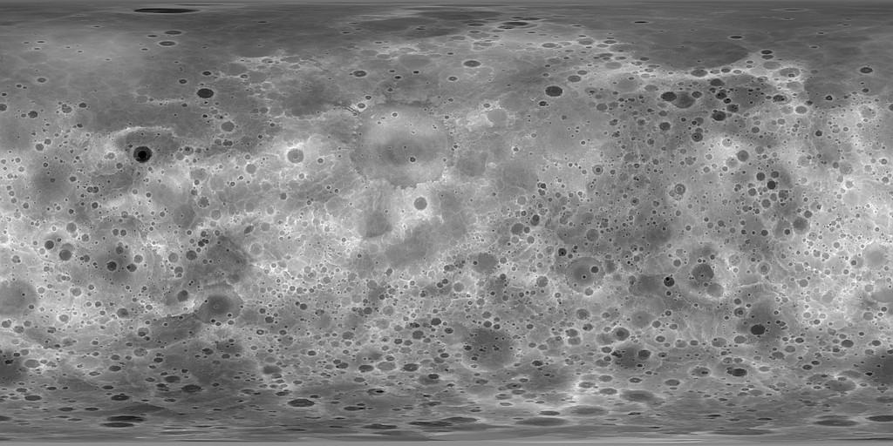
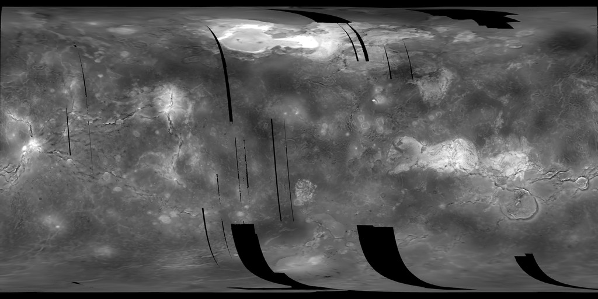

# Contents
- [Contents](#contents)
- [Introduction](#introduction)
    - [DEM vs DSM vs DTM](#dem-vs-dsm-vs-dtm)
- [Links](#links)
    - [Papers](#papers)
    - [Portals](#portals)
    - [Discussion](#discussion)
- [Data](#data)
  - [Global, open](#global-open)
    - [Summary](#summary)
    - [ASTER GDEM](#aster-gdem)
    - [SRTM DEM](#srtm-dem)
    - [NASADEM](#nasadem)
    - [ALOS World 3D-30m](#alos-world-3d-30m)
    - [Copernicus DEM](#copernicus-dem)
    - [MERIT](#merit)
    - [FABDEM](#fabdem)
    - [TanDEM-X](#tandem-x)
  - [Global, proprietary](#global-proprietary)
    - [WorldDEM and TanDEM-X](#worlddem-and-tandem-x)
    - [Vricon](#vricon)
  - [Global bathymetric, open](#global-bathymetric-open)
    - [ETOPO1](#etopo1)
    - [GMRT](#gmrt)
    - [GEBCO](#gebco)
    - [SRTM15+](#srtm15)
  - [Local, open](#local-open)
    - [EU-DEM](#eu-dem)
    - [EU-DTM](#eu-dtm)
    - [US: 3DEP](#us-3dep)
    - [ArcticDEM](#arcticdem)
    - [Arctic: REMA](#arctic-rema)
    - [Australia: Elvis - Elevation and Depth](#australia-elvis---elevation-and-depth)
    - [France: Litto3D](#france-litto3d)
    - [France: RGE ALTI](#france-rge-alti)
    - [France: HD-LIDAR](#france-hd-lidar)
    - [High Mountain Asia DEM](#high-mountain-asia-dem)
  - [Non-terrestrial, open](#non-terrestrial-open)
    - [Lunar Orbiter Laser Altimeter (LOLA)](#lunar-orbiter-laser-altimeter-lola)
    - [Pluto New Horizon](#pluto-new-horizon)
    - [Mars Orbiter Laser Altimeter (MOLA)](#mars-orbiter-laser-altimeter-mola)
    - [Charon New Horizon](#charon-new-horizon)
    - [Mercury Messenger](#mercury-messenger)
    - [Venus Magellan](#venus-magellan)

# Introduction
A [Digital Elevation Model](https://en.wikipedia.org/wiki/Digital_elevation_model) (DEM) represents the elevation of the surface.

### DEM vs DSM vs DTM
It is useful to distinguish between DSM and DTM. 

- **Digital Surface Model** (**DSM**): Includes objects on the surface, such as trees and buildings.
- **Digital Terrain Model** (**DTM**): Represents the bare surface.

In this repo, **DEM** is a generic term referring to either a **DSM** or a **DTM**. Note however that **DEM** is often also equated with **DTM**.

This graphic from [Neon](https://www.neonscience.org/resources/learning-hub/tutorials/chm-dsm-dtm-gridded-lidar-data) summarizes the differences well:

For a more detailed discussion, see [Digital Elevation Models: Terminology and Definitions](https://www.mdpi.com/2072-4292/13/18/3581).

# Links
### Papers
- [Vertical Accuracy of Freely Available Global Digital Elevation Models (ASTER, AW3D30, MERIT, TanDEM-X, SRTM, and NASADEM)](https://www.mdpi.com/2072-4292/12/21/3482)
- [Comparative accuracy of the AW3D30 DSM, ASTER GDEM, and SRTM1 DEM: A case study on the Zaoksky testing ground, Central European Russia](https://www.tandfonline.com/doi/full/10.1080/2150704X.2018.1468098)
- [Accuracy assessment of the TanDEM-X 90 Digital Elevation Model for selected floodplain sites](https://www.sciencedirect.com/science/article/pii/S0034425719303384)
- [Evaluation of TanDEM-X DEMs on selected Brazilian sites: Comparison with SRTM, ASTER GDEM and ALOS AW3D30](https://www.sciencedirect.com/science/article/abs/pii/S0034425718302001?via%3Dihub)

### Portals
- [OpenTopography](https://opentopography.org/)
- [AWS Open Data](https://registry.opendata.aws/)
- [Microsoft Planetary Computer Data Catalog](https://planetarycomputer.microsoft.com/catalog)
- [Google Earth Engine Data Catalog](https://developers.google.com/earth-engine/datasets/catalog)
- [Sentinel Hub](https://www.sentinel-hub.com/)

### Discussion
- [Discussion on Joe Morrison's DEM tweet](https://twitter.com/mouthofmorrison/status/1538679755674984448)

# Data
## Global, open

### Summary
| Dataset           | Type   | Horizontal resolution (m)   | Vertical accuracy (m)   | Data collection period   | Method                 | Notes                                             |
|:------------------|:-------|:----------------------------|:------------------------|:-------------------------|:-----------------------|:--------------------------------------------------|
| ASTER GDEM V3     | DSM    | 30                          | 17                      | 2000-2011                | Photogrammetry         |                                                   |
| SRTM DEM V3       | DSM    | 30 USA, 90 outside          | 9                       | 2000                     | InSAR                  | Coverage between 60° north and 56° south latitude |
| NASADEM           | DSM    | 30                          |                         | 2000                     | InSAR                  | Reprocessing of SRTM                              |
| AW3D30            | DSM    | 30                          | 5                       | 2006-2011                | Photogrammetry         |                                                   |
| COPERNICUS GLO-30 | DSM    | 30                          | 4                       | 2011-2015                | InSAR                  | Based on WorldDEM                                 |
| MERIT             | DSM    | 90                          | 12                      | 2000, 2006-2011          | InSAR + Photogrammetry | Created from SRTM + AW3D30                        |
| FABDEM            | DTM    | 30                          | 1.12-2.88 (mean error)  | 2011-2015                | InSAR                  | Used ML to remove buildings+trees from GLO-30     |
| TanDEM-X 90m      | DSM    | 90                          | 10                      | 2010-2015                | InSAR                  |                                                   |

#### Which DEM is derived from which base dataset?

### ASTER GDEM

Advanced Spaceborne Thermal Emission and Reflection satellite
- Optical sensor, stereopair images

#### Products
- **ASTER GDEM2**: Released 2011, acquired more scenes 2008-2011
- **ASTER GDEM3**

#### Links
- [NASA JPL: ASTER GDEM](https://asterweb.jpl.nasa.gov/gdem.asp)

### SRTM DEM

Shuttle Radar Topography Mission
- NASA + NGA
- Space shuttle **Endeavour**

Coverage is only between 60° north and 56° south latitude

#### Products
- **SRTM Non-Void Filled**
- **SRTM Void Filled**: More processing to fill missing data (not actually missing, but low quality)
- **SRTM 1 Arc-Second Global**

#### Links
- [USGS: SRTM](https://www.usgs.gov/centers/eros/science/usgs-eros-archive-digital-elevation-shuttle-radar-topography-mission-srtm-1?qt-science_center_objects=0#qt-science_center_objects)
- [OpenTopography](https://portal.opentopography.org/datasetMetadata?otCollectionID=OT.042013.4326.1)

### NASADEM
Reprocessing of SRTM
- Using the latest unwrapping techniques
- More voids filled with auxiliary data
    - ASTER GDEM, Advanced Land Observing Satellite (ALOS) Panchromatic Remote sensing Instrument for Stereo Mapping (PRISM), USGS National Elevation Dataset (NED), and Canada and Alaska DEMs Global DEM Specifications

[Comparison with CopernicusDEM in the Indus delta region](https://twitter.com/3vetion/status/1538934235679141888)

#### Links
- [User guide](https://lpdaac.usgs.gov/documents/434/ASTGTM_User_Guide_V3.pdf)
- [OpenTopography](https://portal.opentopography.org/raster?opentopoID=OTSDEM.032021.4326.2)

### ALOS World 3D-30m
- ALOS PRISM
- From JAXA

#### Products
- **AW3D30**

#### Links
- [OpenTopography](https://portal.opentopography.org/datasetMetadata?otCollectionID=OT.112016.4326.2)

### Copernicus DEM
Based on WorldDEM/TanDEM-X

Does not cover areas around Azerbaijan and Armenia

Product comparison

#### Products
- **GLO-90** worldwide 90m
- **GLO-30** limited worldwide 30m
    - doesn't cover Azerbaijan and Armenia
- **EEA-10** Europe only, not publicly avaialable ([access rights](https://spacedata.copernicus.eu/web/cscda/copernicus-users/access-rights#C5))

#### Links
- [AWS: Copernicus DEM](https://registry.opendata.aws/copernicus-dem/)
- [OpenTopography](https://portal.opentopography.org/datasetMetadata?otCollectionID=OT.032021.4326.1)
- [Dataset details](https://spacedata.copernicus.eu/web/cscda/dataset-details?articleId=394198)
- [Product Handbook](https://spacedata.copernicus.eu/explore-more/news-archive/-/asset_publisher/Ye8egYeRPLEs/blog/id/434960)
- [FAQ](https://spacedata.copernicus.eu/web/cscda/cop-dem-faq)
- [More info](https://hyp3-docs.asf.alaska.edu/dems/#copernicus-dem)

### MERIT
Created by combining SRTM and ALOS Word 3D
- Removal of errors and noise

#### Links
- [Webpage](http://hydro.iis.u-tokyo.ac.jp/~yamadai/MERIT_DEM/)
- [Paper](https://agupubs.onlinelibrary.wiley.com/doi/full/10.1002/2017GL072874)

### FABDEM
DTM, processed GLO-30
- Used ML to remove buildings and trees 

License
- Available for research 
- Commercial use requires purchase

#### Links
- [A 30 m global map of elevation with forests and buildings removed](https://iopscience.iop.org/article/10.1088/1748-9326/ac4d4f)
- [Thread about FABDEM](https://twitter.com/Nrg8000/status/1491022045341118469)

### TanDEM-X
See [section below](#worlddem-and-tandem-x) for more details.

The 90m version should be open for research use.
- It also might be possible to obtain a limited access to the 12m and/or 30m versions ([source](https://twitter.com/ishiba/status/1538858150538919937))

#### Links
- [Geoservice DLR: TanDEM-X 90m](https://geoservice.dlr.de/web/dataguide/tdm90/)
- [Product specification](https://geoservice.dlr.de/web/dataguide/tdm90/pdfs/TD-GS-PS-0021_DEM-Product-Specification.pdf)

## Global, proprietary
### WorldDEM and TanDEM-X
Collection of open and proprietary DEMs from Airbus (WorldDEM) and DLR (TanDEM-X)

#### Products
- [WorldDEM](https://apollomapping.com/digital-elevation-models/worlddem) (12m) and [WorldDEM Neo](https://apollomapping.com/digital-elevation-models/worlddem) (5m)
- [TanDEM-X 12m](https://gdk.gdi-de.org/geonetwork/srv/api/records/5eecdf4c-de57-4624-99e9-60086b032aea)
- [TanDEM-X 30m](https://gdk.gdi-de.org/geonetwork/srv/api/records/8545a026-2e0c-466f-b6de-99faa639e3c0)
- [TanDEM-X 90m](https://geoservice.dlr.de/web/dataguide/tdm90/), [product specification](https://geoservice.dlr.de/web/dataguide/tdm90/pdfs/TD-GS-PS-0021_DEM-Product-Specification.pdf)

### Vricon
5m
- [Apollo Mapping article](https://apollomapping.com/blog/50-cm-vricon-digital-elevation-models-dems-now-available)

## Global bathymetric, open
### ETOPO1
ETOPO1 is a 1 arc-minute global relief model of Earth's surface that integrates land topography and ocean bathymetry. Built from global and regional data sets, it is available in "Ice Surface" (top of Antarctic and Greenland ice sheets) and "Bedrock" (base of the ice sheets). 
- ~2km resolution

#### Links
- [Project website](https://www.ngdc.noaa.gov/mgg/global/)

### GMRT
Global Multi-Resolution Topography Data Synthesis
- synthesis of multi-resolution multibeam sonar data
- 100m resolution
- latest version: GMRT 4.0., released in 2022

#### Links
- [Project website](https://www.gmrt.org/)
- [OpenTopography](https://portal.opentopography.org/datasetMetadata?otCollectionID=OT.112016.4326.1)

### GEBCO
GEBCO’s current gridded bathymetric data set, the GEBCO_2022 Grid, is a global terrain model for ocean and land, providing elevation data, in meters, on a 15 arc-second interval grid. It is accompanied by a Type Identifier (TID) Grid that gives information on the types of source data that the GEBCO_2022 Grid is based on.
- ~250m resolution

#### Links
- [Project website]((https://www.ngdc.noaa.gov/mgg/global/))

### SRTM15+
Global Bathymetry and Topography
- SRTM plus shipboard sounding and satellite-derived predicted depths
- 15 arcsec resolution (approximately 500x500m pixel size at equator)
- latest version: SRTM+ V2.1., released in 2019

#### Links
- [Project website](https://topex.ucsd.edu/WWW_html/srtm15_plus.html)
- [OpenTopography](https://portal.opentopography.org/datasetMetadata?otCollectionID=OT.122019.4326.1)
- [Paper (V2.0)](https://agupubs.onlinelibrary.wiley.com/doi/full/10.1029/2019EA000658)

## Local, open
### EU-DEM
DSM, fusion of SRTM and ASTER GDEM
- 30m horizontal resolution
- 7m vertical RMSE

#### Links
- [EEA Data](https://www.eea.europa.eu/data-and-maps/data/copernicus-land-monitoring-service-eu-dem)

### EU-DTM
Used Ensemble Machine Learning with GEDI and ICESat-2 data to process available DSMs into a DTM
- DSMs used:  MERITDEM, AW3D30, GLO-30, EU DEM, GLAD canopy height

#### Links
- [Paper](https://zenodo.org/record/4724549)
- [OpenGeoHub](https://opengeohub.org/datasets/european-digital-terrain-models-eu-dtm/)
- [OpenDataScience Article](https://opendatascience.eu/geo-harmonizer/building-continental-europe-digital-terrain-model-30-m-resolution-using-machine-learning/)

### US: 3DEP
USGS 3D Elevation Program (3DEP) 
- Lidar-derived data
- Very high resolution (2m)
- Multiple DSM/DTM products

#### Links
- [Planety Computer Catalog](https://planetarycomputer.microsoft.com/catalog?tags=3DEP&filter=3DEP)
- [USGS Lidar explorer](https://prd-tnm.s3.amazonaws.com/LidarExplorer/index.html#/)

### ArcticDEM
DSM of the Arctic  
- Photogrammetry from stereo imagery
- 2m horizontal resolution

#### Links
- [ArcticDEM](https://www.pgc.umn.edu/data/arcticdem/)

### Arctic: REMA
Timestamped elevation model of the Arctic
- Can measure elevation change
- 8m horizontal resolution

#### Links
- [REMA](https://www.pgc.umn.edu/data/rema/)

### Australia: Elvis - Elevation and Depth
DEMs, DSMs and point clouds for Australia
- A repository of state and national datasets 
- Generally lidar-derived data
- Resolutions include
    - 1m
    - 2m
    - 5m
    - 1 second
- Complete coverage for NSW, Victoria and Tasminia with partial coverage in other state/territories
- Bathymetry also provided for surrounding waters

#### Links
- [Elvis - Elevation and Depth - Foundation Spatial Data](https://elevation.fsdf.org.au/)

### France: Litto3D
Coastal areas in mainland France, topographic and bathymetric information
- 1km resolution

#### Links
- [SHOM website (in French)](https://diffusion.shom.fr/pro/risques/litto3dr-finistere-2014.html)
- [English description](https://sextant.ifremer.fr/geonetwork/srv/api/records/4c54ac5e-9b83-42ad-b10e-e0769d6a1cd3)
- [Blog post](https://blog.geogarage.com/2015/11/litto3d-french-coastal-dtm.html)

### France: RGE ALTI
DTM of France (including ultramarine territories). This DEM is updated each year with new acquisitions (usually lidar)
- ~1m resolution. Varies by altitude (mountain areas have around 7m resolution).
- Created from airborne LIDAR, correlation of aerial images and radar (Mountains and French Guyana)
- RGE: Hight-Scale Referential in French

#### Links
- [Website with FTP download links](https://geoservices.ign.fr/rgealti)
- [Documentation](https://geoservices.ign.fr/sites/default/files/2021-07/DC_RGEALTI_2-0.pdf)
- [Map of sources](https://www.geoportail.gouv.fr/carte?c=4.7481202376327944,46.47822241851&z=7&l0=ORTHOIMAGERY.ORTHOPHOTOS::GEOPORTAIL:OGC:WMTS(1)&l1=ELEVATIONGRIDCOVERAGE.HIGHRES.QUALITY::GEOPORTAIL:OGC:WMTS(1)&permalink=yes)

### France: HD-LIDAR
Ongoing LIDAR acquisition campaign
- Point-cloud data processed into DTMs, DSMs and digital height models

#### Links
- [Website](https://geoservices.ign.fr/lidarhd)

### High Mountain Asia DEM
High mountain asia glaciers
- 8m resolution
- From DigitalGlobe imagery, collected 2002-2016
- Spatial region: from Tien Shan and Hindu Kush to Eastern Himalaya

#### Links
- [NSIDC HMA Website](https://nsidc.org/data/highmountainasia)
- [NSIDC Blog](https://nsidc.org/the-drift/data-update/high-mountain-asia-8-meter-digital-elevation-models-now-available/)

## Non-terrestrial, open

### Lunar Orbiter Laser Altimeter (LOLA)

Lunar DEM created by the *Lunar Reconnaissance Orbiter* (LRO) mission. The data is available in several versions. A DEM covering the entire lunar surface at a resolution of 118m and a DEM of resolution 59m covering latitudes within ±60.

#### Links
- [Moon LRO LOLA DEM 118m v1](https://astrogeology.usgs.gov/search/map/Moon/LRO/LOLA/Lunar_LRO_LOLA_Global_LDEM_118m_Mar2014)
- [Moon LRO LOLA - SELENE Kaguya TC DEM Merge 60N60S 59m v1](https://astrogeology.usgs.gov/search/map/Moon/LRO/LOLA/Lunar_LRO_LOLAKaguya_DEMmerge_60N60S_512ppd)

### Pluto New Horizon

A partial DEM of Pluto with a resolution of 300m

#### Links
- [Pluto New Horizons LORRI - MVIC Global DEM 300m v1](https://astrogeology.usgs.gov/search/map/Pluto/NewHorizons/Pluto_NewHorizons_Global_DEM_300m_Jul2017)

###  Mars Orbiter Laser Altimeter (MOLA)

A DEM of Mars with a resolution of 463m

#### Links
- [Mars MGS MOLA DEM 463m v2](https://astrogeology.usgs.gov/search/map/Mars/GlobalSurveyor/MOLA/Mars_MGS_MOLA_DEM_mosaic_global_463m)

### Charon New Horizon

A partial DEM of Pluto with a resolution of 300m

#### Links
- [Charon New Horizons LORRI MVIC Global DEM 300m v1](https://astrogeology.usgs.gov/search/map/Charon/NewHorizons/Charon_NewHorizons_Global_DEM_300m_Jul2017)

### Mercury Messenger

A DEM of Mercury with a resolution of 665m

#### Links
- [Mercury MESSENGER Global DEM 665m v2](https://astrogeology.usgs.gov/search/map/Mercury/Topography/MESSENGER/Mercury_Messenger_USGS_DEM_Global_665m_v2)

### Venus Magellan

A Dem of Venus with a resolution of 4641m

#### Links
- [Venus Magellan Global Topography 4641m v2](https://astrogeology.usgs.gov/search/map/Venus/Magellan/RadarProperties/Venus_Magellan_Topography_Global_4641m_v02)

----
- *Logo created with* [*Brandmark*](https://app.brandmark.io/v3/)
